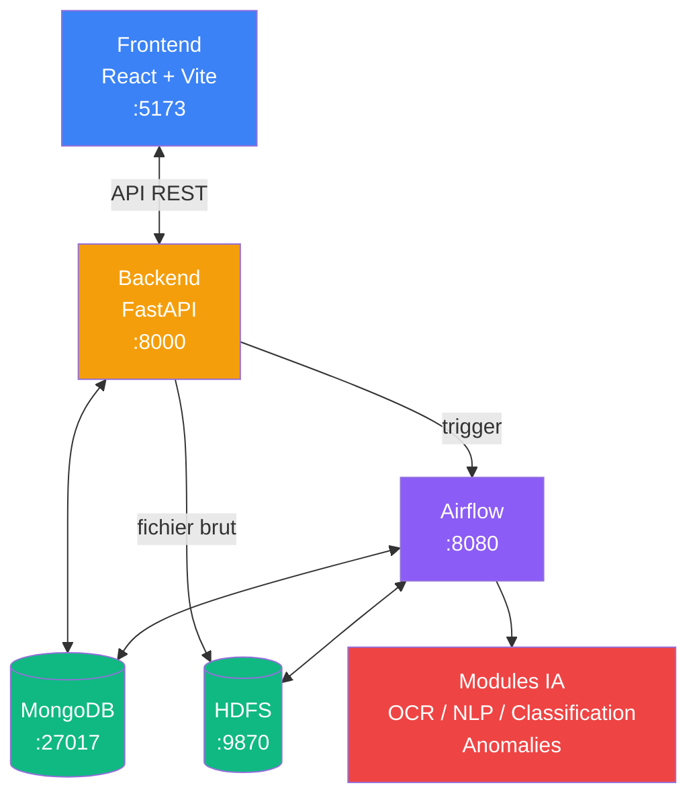
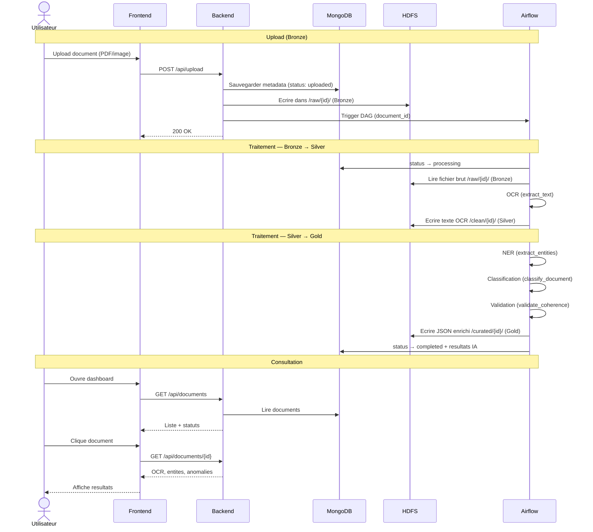
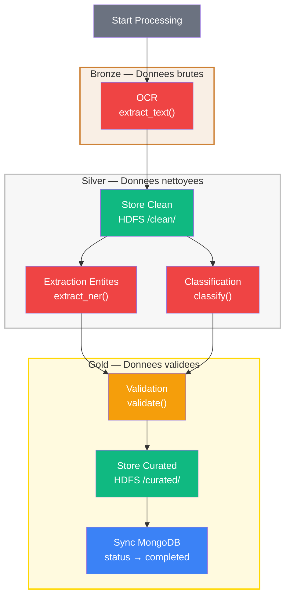

# DocuScan AI — Plateforme Intelligente de Traitement Documentaire

Plateforme de traitement automatisé de documents administratifs (factures, devis, attestations URSSAF, Kbis, RIB) combinant OCR, NLP et détection d'anomalies pour extraire, valider et distribuer les données vers des applications métiers.

**Projet Hackathon 2026 — 7 membres**

---

## Stack Technique

| Couche | Technologie | État |
|---|---|---|
| **Front-end** | React 19, Vite 8, TailwindCSS 4 | Fonctionnel (7 pages) |
| **Back-end / API** | FastAPI (Python) | Fonctionnel (16 endpoints) |
| **Base de données** | MongoDB (motor async) | Fonctionnel |
| **Data Lake** | Hadoop HDFS (3 zones : Raw / Clean / Curated) | Fonctionnel |
| **OCR** | Tesseract (fra+eng), pypdf, python-docx | Fonctionnel |
| **Classification** | TF-IDF+SVM (entraîné, 100% F1) / zero-shot XLM-RoBERTa / keywords | Fonctionnel |
| **NLP / NER** | Regex + spaCy fr_core_news_md + rapidfuzz | Fonctionnel |
| **Anomaly Detection** | Règles déterministes (Luhn, SIREN, BIC, RIB key, mod97, TVA, dates, montants) | Fonctionnel |
| **Orchestration** | Apache Airflow | Fonctionnel (DAG 8 tâches) |
| **Conteneurisation** | Docker / Docker Compose (cache layers, limites mémoire, .dockerignore) | Fonctionnel (8 services) |

---

## Architecture

```
 ┌─────────────────────────────────────────────────────────────────────────────┐
 │                            Docker Compose                                  │
 │                                                                            │
 │   ┌────────────┐       ┌────────────┐       ┌────────────────┐            │
 │   │  React     │       │  FastAPI   │       │    MongoDB     │            │
 │   │  Frontend  │◄─────►│  Backend   │◄─────►│                │            │
 │   │  :5173     │ REST  │  :8000     │ async │  Hackathon DB  │            │
 │   └────────────┘       └─────┬──────┘       └───────▲────────┘            │
 │                              │                      │                     │
 │                  ┌───────────┼───────────┐           │ sync               │
 │                  │  fichier  │  trigger  │           │ (tâche 8)          │
 │                  ▼           ▼           │           │                     │
 │   ┌────────────────┐   ┌────────────────┴───────────┴──────────────┐      │
 │   │  Hadoop HDFS   │   │  Airflow DAG — document_pipeline         │      │
 │   │  :9870         │   │  :8080                                    │      │
 │   │                │   │                                           │      │
 │   │  ┌──────────┐  │   │  ┌─────────┐   ┌──────────┐             │      │
 │   │  │ /raw/    │◄─┼───┼──┤ 1. OCR  ├──►│ 2. Clean │             │      │
 │   │  │ Bronze   │  │   │  └─────────┘   └────┬─────┘             │      │
 │   │  ├──────────┤  │   │                     │                    │      │
 │   │  │ /clean/  │◄─┼───┼─────────────────────┘                   │      │
 │   │  │ Silver   │──┼───┼──►┌─────────┐  ┌──────────┐  ┌───────┐ │      │
 │   │  ├──────────┤  │   │  │ 3. NER  ├─►│ 4. Class ├─►│5. Val │  │      │
 │   │  │/curated/ │◄─┼───┼──────────────────────────────┤       │  │      │
 │   │  │ Gold     │  │   │  └─────────┘  └──────────┘  └───┬───┘  │      │
 │   │  └──────────┘  │   │                                 │      │      │
 │   └────────────────┘   │  ┌─────────────┐  ┌─────────────┘      │      │
 │                        │  │ 7. Sync DB  │◄─┘                    │      │
 │                        │  │             ├─── auto-create case   │      │
 │                        │  └─────────────┘                       │      │
 │                        │                                        │      │
 │                        │  Modules IA :                          │      │
 │                        │  ● OCR Tesseract (fra+eng)             │      │
 │                        │  ● NER regex + spaCy + fuzzy           │      │
 │                        │  ● Classification SVM + zero-shot      │      │
 │                        │  ● Validation 13+ règles               │      │
 │                        └────────────────────────────────────────┘      │
 │                                                                        │
 └────────────────────────────────────────────────────────────────────────┘
```

### Diagramme d'architecture (Mermaid)



### Flux utilisateur détaillé (Mermaid)



### Pipeline Airflow — Data Lake Bronze / Silver / Gold (Mermaid)



### Flux résumé

- **Upload** : Front → FastAPI → métadonnées MongoDB + fichier HDFS Raw → trigger Airflow DAG
- **Pipeline** : Airflow lit HDFS Raw → OCR → HDFS Clean → NER/Classif/Anomaly → HDFS Curated → sync MongoDB + auto-création case
- **Lecture** : Front → FastAPI → MongoDB (données structurées)

### Stockage — HDFS + MongoDB

| Composant | Rôle |
|---|---|
| **HDFS — Raw** `/raw/{id}/` | Documents bruts (PDF, images) écrits par le backend via WebHDFS à l'upload |
| **HDFS — Clean** `/clean/{id}/` | Texte extrait par OCR (format texte brut) |
| **HDFS — Curated** `/curated/{id}/` | Données structurées enrichies (JSON) |
| **MongoDB** `Hackathon` | Base applicative — métadonnées documents, résultats IA (entités, classification, anomalies), cases, compliances |

---

## Structure du Projet

```
hackaton-groupe-12/
├── frontend/                  # Application React 19 + Vite 8 + TailwindCSS 4
│   ├── src/
│   │   ├── api/               # Appels API (axios, documents, cases, compliance)
│   │   ├── components/        # Layout, Header, ErrorAlert, StatCard, SectionCard, StatusBadge
│   │   ├── pages/             # 7 pages (Home, CRM, CaseDetails, Document, Compliance, Upload, Dashboard)
│   │   ├── utils/             # statusUtils (normalisation statuts, badges)
│   │   └── Router.jsx         # Configuration des routes
│   ├── .env                   # VITE_API_URL=http://127.0.0.1:8000
│   └── package.json
│
├── backend/                   # API FastAPI (Python)
│   ├── main.py                # Entry point, CORS middleware
│   ├── params.py              # Variables d'environnement
│   ├── Dockerfile             # Python 3.11 + Tesseract + spaCy
│   ├── requirement.txt
│   ├── config/database.py     # Motor async client, collections
│   ├── model/                 # Pydantic models (document, case, compliance)
│   ├── routes/                # uploadsRoute, documents, cases, compliances
│   ├── services/              # document_processing, ocr_metrics
│   └── utils/                 # logger
│
├── ia/                        # Couche IA
│   ├── ocr/pipeline.py        # Tesseract OCR (PDF/DOCX/images/TXT, fra+eng, correction texte espacé)
│   ├── nlp/ner.py             # NER regex + spaCy fr_core_news_md + rapidfuzz
│   ├── classification/        # TF-IDF+SVM, zero-shot XLM-RoBERTa, keywords cascade
│   │   ├── classifier.py      # 3 méthodes en cascade
│   │   ├── train.py           # Entraînement SVM
│   │   └── benchmark.py       # Matrice de confusion + F1
│   └── anomaly_detection/
│       └── detector.py        # 13+ règles (Luhn, SIREN, BIC, clé RIB, mod97, TVA, dates, montants)
│
├── airflow/                   # Orchestration Apache Airflow
│   ├── dags/
│   │   └── document_pipeline.py   # DAG 8 tâches + auto-création case par SIRET
│   └── plugins/helpers/
│       ├── mongo.py           # Client pymongo sync
│       └── hdfs.py            # Client WebHDFS REST
│
├── data/                      # Générateurs de datasets synthétiques + seed démo
│   ├── generators/            # 5 types : factures, devis, KBIS, URSSAF, RIB
│   └── seed_demo.py           # Script de seed : 3 dossiers fournisseurs (11 docs, 3 formats)
│
├── docs/                      # Diagrammes Mermaid (architecture, flux, pipeline)
│
├── docker/
│   └── docker-compose.yml     # 8 services (mongo, backend, frontend, hdfs×2, airflow×3)
│
├── start.sh                   # Script de gestion Docker (up, down, restart, logs, status, clean)
└── README.md
```

---

## Démarrage Rapide

### Prérequis

- Docker & Docker Compose
- Node.js 18+ (pour le dev frontend hors Docker)
- Python 3.11+ (pour le dev backend hors Docker)

### Lancement avec Docker Compose

```bash
./start.sh up              # Build + start tous les services
./start.sh down            # Arrêter
./start.sh logs            # Suivre les logs
./start.sh logs backend    # Logs d'un service spécifique
./start.sh status          # État des conteneurs
./start.sh clean           # Stop + supprime les volumes
```

Ou manuellement :
```bash
cd docker && docker compose up --build
```

| Service | URL | Credentials |
|---|---|---|
| Front-end React | http://localhost:5173 | — |
| API FastAPI | http://localhost:8000 | — |
| Swagger API docs | http://localhost:8000/docs | — |
| Airflow UI | http://localhost:8080 | admin / admin |
| MongoDB | localhost:27017 | pas d'auth |
| HDFS NameNode UI | http://localhost:9870 | — |

### Lancement en développement (sans Docker)

```bash
# Backend
cd backend
pip install -r requirement.txt
uvicorn main:app --reload     # http://localhost:8000

# Frontend
cd frontend
npm install
npm run dev                   # http://localhost:5173
```

> **Note** : MongoDB, HDFS et Airflow doivent tourner (via Docker ou en local) pour que le backend fonctionne complètement.

---

## API — Endpoints

| Méthode | Route | Description |
|---|---|---|
| `GET` | `/` | Health check |
| `POST` | `/api/upload` | Upload fichier(s) → MongoDB + HDFS + trigger Airflow |
| `GET` | `/api/documents` | Liste des documents (avec pagination) |
| `GET` | `/api/documents/{id}` | Détail document (OCR, entités, classification, anomalies) |
| `PUT` | `/api/documents/{id}` | Corriger / valider un document |
| `GET` | `/api/documents/{id}/download` | Télécharger le fichier depuis HDFS |
| `GET` | `/api/documents/{id}/metrics` | Métriques OCR (CER, WER) |
| `GET` | `/api/cases` | Liste des dossiers |
| `GET` | `/api/cases/{id}` | Détail dossier |
| `POST` | `/api/cases` | Créer un dossier |
| `PUT` | `/api/cases/{id}` | Mettre à jour un dossier |
| `GET` | `/api/cases/{id}/autofill` | Auto-remplissage depuis les documents du dossier |
| `GET` | `/api/compliances` | Liste conformités |
| `GET` | `/api/compliances/{id}` | Détail conformité |
| `GET` | `/api/compliances/case/{id}` | Conformité par dossier |
| `POST` | `/api/compliances` | Créer un contrôle de conformité |
| `PUT` | `/api/compliances/{id}` | Mettre à jour conformité |

---

## Pipeline Airflow

DAG `document_pipeline` — 8 tâches séquentielles, déclenché par le backend à chaque upload. Pool ML (2 slots) pour les tâches IA, parallélisme contrôlé :

```
start_processing → run_ocr → store_clean_hdfs → extract_entities → classify_document → validate_coherence → store_curated_hdfs → sync_mongodb
```

| Tâche | Description |
|---|---|
| `start_processing` | Status MongoDB → "processing" |
| `run_ocr` | Lit fichier HDFS Raw, appelle `ia.ocr.pipeline.extract_text()` |
| `store_clean_hdfs` | Écrit le texte OCR dans HDFS Clean |
| `extract_entities` | Appelle `ia.nlp.ner.extract()` — regex + spaCy + fuzzy |
| `classify_document` | Appelle `ia.classification.classifier.classify()` — SVM / zero-shot / keywords |
| `validate_coherence` | Appelle `ia.anomaly_detection.detector.validate()` — 13+ vérifications |
| `store_curated_hdfs` | Écrit le JSON enrichi dans HDFS Curated |
| `sync_mongodb` | Met à jour le document MongoDB + auto-création de case par SIRET |

### Modules IA

```python
# ia/ocr/pipeline.py — Tesseract OCR + correction texte espacé (Canva)
def extract_text(raw_content: bytes, content_type: str, filename: str = "") -> str

# ia/nlp/ner.py — Regex + spaCy fr_core_news_md + rapidfuzz
def extract(text: str) -> dict
# Retour : {siret, vat, amount_ht, amount_ttc, issue_date, expiration_date, company_name, iban, details: {...}}

# ia/classification/classifier.py — TF-IDF+SVM / zero-shot XLM-RoBERTa / keywords
def classify(text: str) -> dict
# Retour : {document_type: str, confidence: float, method: str}

# ia/anomaly_detection/detector.py — Règles déterministes
def validate(entities: dict, classification: dict, document_id: str, collection=None) -> dict
# Retour : {is_valid: bool, anomalies: [{field, message, level}]}
```

---

## Scénarios de Test

| Scénario | Description | Résultat |
|---|---|---|
| Facture PDF standard | Extraction complète (SIRET, TVA, montants, dates) | OK |
| KBIS format PNG (OCR) | Tesseract extrait SIRET, dénomination, forme juridique | OK |
| Devis format JPG (OCR) | Montants HT/TTC, dates, numéro de devis extraits | OK |
| PDF design (Canva) | Texte espacé "F A C T U R E" reconstruit automatiquement | OK |
| Incohérence SIRET | SIRET invalide (Luhn) → anomalie détectée | OK |
| TVA incohérente | Montant HT × taux ≠ TTC → anomalie détectée | OK |
| Dossier complet | 4 docs (Facture+KBIS+URSSAF+RIB) → case approved | OK |
| Dossier incomplet | 1 facture seule → case pending, pièces manquantes signalées | OK |
| Multi-format | PDF, PNG, JPG tous traités par le même pipeline | OK |

### Seed de données de démonstration

Le script `data/seed_demo.py` génère et uploade 11 documents réalistes pour 3 dossiers fournisseurs couvrant tous les cas d'usage :

| Dossier | Secteur | Documents | Formats | Anomalies |
|---|---|---|---|---|
| Durand Construction SARL | BTP | Facture + Devis + RIB + URSSAF + KBIS | PDF, PNG, JPG | Aucune |
| TechNova Solutions SAS | IT | Facture + RIB + KBIS | PDF | Aucune |
| Les Jardins de Provence EURL | Restauration | Facture + URSSAF + RIB | JPG, PNG, PDF | Montants HT+TVA≠TTC, URSSAF expirée |

```bash
# Lancer après docker compose up :
docker exec -e API_URL=http://localhost:8000 docuscan-backend python /app/data/seed_demo.py
```

### Modèle SVM — Classification

Le modèle entraîné (`ia/classification/model/tfidf_svm.joblib`) est inclus dans le repo :
- **620 échantillons** (496 train / 124 test)
- **5 classes** : Facture, Devis, Attestation (URSSAF), KBIS, RIB
- **99% accuracy** (F1 = 0.99 sur toutes les classes)
- Métriques détaillées dans `ia/classification/model/metrics.json`

---

## Équipe — 7 membres

| Rôle | Périmètre |
|---|---|
| **Dev Fullstack 1** | Front-end React — pages Upload & Dashboard |
| **Dev Fullstack 2** | Front-end React — CRM & Outil de Conformité |
| **Dev Fullstack 3** | API FastAPI — routes, modèles, intégration MongoDB |
| **Dev Fullstack 4** | Infrastructure Docker, DevOps, tests |
| **Data/IA 1** | Génération de datasets, OCR (Tesseract) |
| **Data/IA 2** | NER, classification de documents, détection d'anomalies |
| **Data/IA 3 — Chef de projet** | Orchestration Airflow, DAGs, monitoring, coordination |

---

## Licence

Projet académique — Hackathon 2026.
